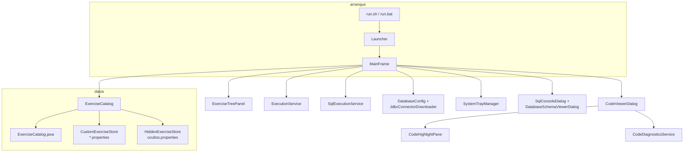
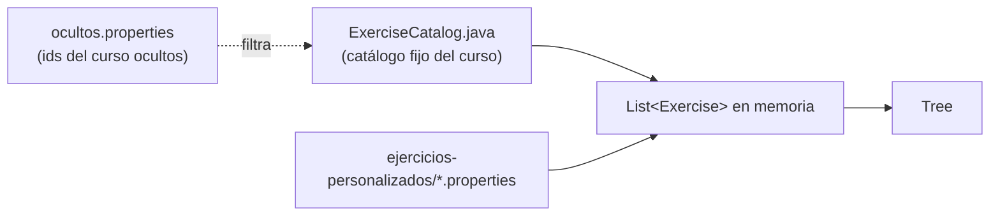

# Ejercicios — POO y Bases de datos con Java


Colección de ejercicios básicos para practicar la  
*programación con lenguajes orientados a objetos y bases de datos relacionales*.

Incluye el visor gráfico **JAVe-Ando** (Swing, v1.1) para leer enunciados, practicar con tu propio código en `trabajo/`, consultar soluciones, **ejecutar Java y SQL (JDBC)**, editar con **resaltado de sintaxis en vivo**, **sugerencias de código**, **formatear sangría**, abrir una **consola SQL** con historial, explorar el **esquema gráfico** (diagrama arrastrable) y, si el escritorio lo permite, usar un icono en la **bandeja del sistema**. Funciona en **Linux, Windows y macOS**.

## Estructura del repositorio

```
.
├── modulo-poo/          # Enunciados de programación orientada a objetos
├── modulo-bbdd/         # Enunciados de SQL, diseño ER, JDBC y proyecto integrador
├── soluciones/          # Soluciones oficiales del repositorio (consultar tras intentar)
│   ├── modulo-poo/
│   └── modulo-bbdd/
├── trabajo/             # Tu código personal (JAVe-Ando — botón «Mi código»)
│   ├── modulo-poo/      # Misma estructura que soluciones/
│   └── modulo-bbdd/
├── ejercicios-personalizados/  # Datos locales del visor (no versionar todo; ver .gitignore)
│   ├── *.properties            # Ejercicios añadidos desde el menú Ejercicios
│   ├── ocultos.properties      # Ids del curso ocultos en el índice
│   ├── sql-historial.txt       # Historial de la consola SQL
│   └── esquema-diagrama/       # Posiciones del diagrama ER por base
├── sql/                 # Scripts de creación de bases de datos
├── lib/                 # JAR JDBC (vacío = descarga automática la 1.ª vez)
├── img/                 # Logo (`logo.png`) y recursos del visor
├── jave-ando.jar        # (opcional) JAR ejecutable generado por ti
└── viewer/              # Código fuente de JAVe-Ando
    ├── run.sh           # Arranque en Linux / macOS
    ├── run.bat          # Arranque en Windows
    └── src/             # Fuentes Java del visor
```

La carpeta `trabajo/` no sustituye a `soluciones/`: es donde el alumno guarda sus intentos sin modificar la solución publicada (ver `trabajo/README.md`).

## Categorías (módulos del índice)

En JAVe-Ando los ejercicios se agrupan en el árbol por el campo **módulo** del catálogo:

| Módulo en el visor | Carpeta de enunciados | Tipo habitual | Prefijo de id |
|--------------------|------------------------|---------------|---------------|
| Programación orientada a objetos | `modulo-poo/` | Java (`JAVA`) | `poo-` |
| Bases de datos | `modulo-bbdd/` (raíz) | SQL o teoría (`SQL`, `MARKDOWN`) | `bbdd-` |
| Acceso a datos con JDBC | `modulo-bbdd/jdbc/` | Java con BD (`JAVA`) | `jdbc-` |
| Proyecto integrador | `modulo-bbdd/proyecto-integrador/` | Sin solución publicada (`NONE`) | `proj-` |

El **prefijo del id** (`poo`, `bbdd`, `jdbc`, `proj`) determina el color del icono en el visor.

## Requisitos

- **Java JDK 17** o superior (`java -version`, `javac -version`)
- **MySQL 8** o **MariaDB 10** (para ejercicios de SQL y JDBC)
- Conector JDBC: se descarga solo en `lib/` al usar SQL en JAVe-Ando (o manualmente; ver `lib/README.md`)

### Compilar y ejecutar (ejemplo)

```bash
cd modulo-poo/01-clases-y-objetos
javac *.java
java Main
```

### Bases de datos y JDBC

**En el visor (recomendado para ejercicios SQL y JDBC):**

1. Arranca JAVe-Ando (`./viewer/run.sh` o `viewer\run.bat`).
2. **Herramientas → Configurar conexión SQL…** — copia el ejemplo, guarda tus credenciales y **Probar conexión** (comprueba el servidor; no exige que la base exista aún).
3. **Ejercicio 01 — Diseño E-R → Ejecutar solución** o **Herramientas → Inicializar base de datos (script 01)…** — crea `academia_idiomas` con `sql/01_crear_base_datos.sql`.
4. **Base de datos → Seleccionar base de datos…** — elige `academia_idiomas` (la barra inferior mostrará `BD: academia_idiomas`).

El conector JDBC se descarga solo en `lib/` la primera vez que hace falta (o colócalo a mano; ver `lib/README.md`). Los scripts `run.sh` / `run.bat` ya incluyen `lib/*.jar` en el classpath del visor.

**Compilar ejercicios JDBC a mano** (terminal):

```bash
cp modulo-bbdd/jdbc/config/database.properties.example modulo-bbdd/jdbc/config/database.properties
# Edita database.properties

javac -cp ".:lib/mysql-connector-j-8.3.0.jar" *.java
java  -cp ".:lib/mysql-connector-j-8.3.0.jar" Main
```

En Windows sustituye `:` por `;` en el classpath.

## JAVe-Ando — Visor gráfico de ejercicios

### Arranque

| Sistema | Comando |
|---------|---------|
| Linux / macOS | `./viewer/run.sh` |
| Windows (CMD) | `viewer\run.bat` |

**Requisitos:** JDK 17+ en `PATH` o variable `JAVA_HOME` configurada (`%JAVA_HOME%\bin` en PATH en Windows).

**Teclado español en Linux:** usa `./viewer/run.sh` para arrancar. El script desactiva `ibus` para esta aplicación (`XMODIFIERS=`), de modo que las teclas muertas funcionen con una sola pulsación (`´` + `a` → `á`). Si lanzas desde el IDE, define la variable de entorno `XMODIFIERS` vacía en la configuración de ejecución.

**Icono en la bandeja:** coloca `img/logo.png` en la raíz del repo. En GNOME/KDE puede hacer falta soporte de iconos de bandeja (p. ej. extensión *AppIndicator*).

Tras modificar el código del visor, vuelve a ejecutar el script de arranque. En Windows, si PowerShell no está disponible, `run.bat` compila el paquete directamente.

Recompilación manual desde `viewer/` (cualquier sistema):

```bash
java -cp out com.ifcd0112.viewer.ViewerBuild
```

### Generar un JAR ejecutable (un solo archivo)

Puedes empaquetar el visor en un **`.jar` ejecutable** con las herramientas del JDK (`javac` + `jar`), sin Maven ni Gradle.

**Importante:** el JAR contiene la aplicación Swing, pero **no sustituye al repositorio**. JAVe-Ando sigue necesitando la raíz del proyecto (`README.md`, `modulo-poo/`, `modulo-bbdd/`, `soluciones/`, `viewer/`, etc.) para leer enunciados y ejercicios. Lanza el JAR **desde la raíz del repositorio** (o desde una carpeta superior que contenga esa estructura).

Para SQL/JDBC, el conector sigue en `lib/` (o se descarga solo la primera vez que hace falta). Si quieres llevar el conector dentro del mismo JAR, sigue la **opción B** de esta misma sección.

#### Opción A — JAR solo del visor (recomendado)

**Linux / macOS** (desde la raíz del repositorio):

```bash
cd viewer
find src -name "*.java" | sort > out/sources.txt
javac -encoding UTF-8 -d out @out/sources.txt
jar --create --file ../jave-ando.jar \
  --main-class com.ifcd0112.viewer.Launcher \
  -C out .
cd ..

# Ejecutar (teclado español en Linux: XMODIFIERS vacío)
XMODIFIERS= java -jar jave-ando.jar
```

**Windows (CMD)**:

```bat
cd viewer
dir /s /b src\*.java > out\sources.txt
javac -encoding UTF-8 -d out @out\sources.txt
jar --create --file ..\jave-ando.jar --main-class com.ifcd0112.viewer.Launcher -C out .
cd ..
java -jar jave-ando.jar
```

En Windows, `jar` y `javac` deben estar en el `PATH` (o en `%JAVA_HOME%\bin`).

**Distribución:** copia `jave-ando.jar` junto con el resto del repositorio (o deja el JAR en la raíz del repo clonado). No basta con enviar solo el `.jar` sin las carpetas de ejercicios.

#### Opción B — JAR con conector JDBC incluido

Útil si quieres un único archivo que también lleve el driver MySQL/MariaDB (más pesado, ~2–4 MB extra). Desde la **raíz del repositorio**:

```bash
mkdir -p build/merge dist
cd viewer
find src -name "*.java" | sort > out/sources.txt
javac -encoding UTF-8 -d ../build/merge @out/sources.txt
cd ..

# Descomprime un JAR de lib/ dentro de build/merge (usa el que tengas en lib/)
(cd build/merge && jar xf ../../lib/*.jar)

# Crea el JAR ejecutable
jar --create --file dist/jave-ando.jar \
  --main-class com.ifcd0112.viewer.Launcher \
  -C build/merge .

XMODIFIERS= java -jar dist/jave-ando.jar
```

Si aún no tienes ningún `.jar` en `lib/`, ejecuta antes `./viewer/run.sh` una vez (descarga el conector) o copia el driver a mano según `lib/README.md`.

#### Comprobar el JAR

```bash
java -jar jave-ando.jar
# o, con ruta explícita al repositorio como directorio de trabajo:
cd /ruta/al/ejercicios-IFCD0112 && java -jar jave-ando.jar
```

Si el visor no encuentra los ejercicios, abre una terminal en la carpeta que contiene `README.md` y `modulo-poo/` y vuelve a lanzar el comando.

### Resumen de funcionalidades

| Área | Qué incluye |
|------|-------------|
| **Índice** | Árbol por módulos; añadir, ocultar o restaurar ejercicios sin recompilar. |
| **Enunciados** | Markdown renderizado en el panel principal. |
| **Editor** | Resaltado Java/SQL en vivo; sugerencias (Ctrl+Espacio); formatear sangría; `javac` y marcas de error; varios `.java` con `// ===== archivo.java =====`. |
| **Ejecución** | Compilar y ejecutar Java o scripts SQL desde la consola integrada (redimensionable). |
| **Base de datos** | Conexión JDBC, elegir base activa, consola SQL (`Ctrl+Alt+S`), esquema gráfico con diagrama arrastrable y vista de datos. |
| **Escritorio** | Tema claro/oscuro; bandeja del sistema; terminales y carpetas del SO. |

### Interfaz principal

- **Índice en árbol** agrupado por módulo (POO, BBDD, JDBC, proyecto).
- **Enunciado** con formato Markdown (títulos, listas, tablas, código).
- **Consola de salida** al ejecutar programas Java o scripts SQL (JDBC); **redimensionable** arrastrando el separador horizontal sobre la consola (o con las flechas del divisor).
- **Tema claro / oscuro** — menú Ver.
- La **raíz del repositorio** se detecta automáticamente (también al lanzar desde el IDE).
- **Bandeja del sistema** (si el escritorio lo permite): icono `img/logo.png`, doble clic para abrir la ventana, menú contextual con las mismas acciones que la barra de menús. Al cerrar la ventana (X), la app queda en la bandeja; **Archivo → Cerrar** o **Cerrar** en el menú de la bandeja termina del todo.

### Panel de acciones (por ejercicio)

| Botón | Función |
|-------|---------|
| **Mi código** | Editor sobre `trabajo/`: resaltado en vivo, **Comparar con solución** (diff verde/rojo), **sugerencias**, **Formatear código**, **Comprobar errores** (`javac`). **Guardar** no modifica `soluciones/`. |
| **Ejecutar mi código** | Java: compila y ejecuta los `.java` de `trabajo/`. SQL: ejecuta tu `.sql` en `trabajo/` contra la base configurada (JDBC). |
| **Ver solución** | Igual que el editor de «Mi código» (resaltado, sugerencias, formatear, comprobar errores). **Guardar** escribe en `soluciones/` (docentes); el alumno debería usar «Mi código». |
| **Ejecutar solución** | Java: compila y ejecuta la solución en `soluciones/`. SQL: ejecuta el `.sql` oficial en la consola del visor. |

En ejercicios **teoría** (Markdown), «Mi código» edita tu `.md` en `trabajo/`. El **01 — Diseño E-R** además permite **Ejecutar solución** para lanzar `sql/01_crear_base_datos.sql` y dejar lista la base antes del DDL (ejercicio 02).

### Conexión y ejecución SQL (resumen)

| Paso | Menú / acción |
|------|----------------|
| Credenciales | **Herramientas → Configurar conexión SQL…** |
| Crear base | **01 — Diseño E-R → Ejecutar solución** o **Inicializar base de datos (script 01)…** |
| Elegir base activa | **Base de datos → Seleccionar base de datos…** |
| Probar consultas | **Base de datos → Consola SQL…** (`Ctrl+Alt+S`, Ctrl+Enter, historial con ↑↓) |
| Ver tablas y datos | **Base de datos → Ver esquema gráfico…** (diagrama arrastrable) |

- **Probar conexión** usa la URL del servidor sin exigir que la base exista (útil antes del ejercicio 01).
- La URL puede llevar `serverTimezone=Europe/Madrid`; el visor interpreta bien el nombre de base (no confunde `Madrid` con una base de datos).
- Al ejecutar scripts, **autocommit** está activo: si un `.sql` falla a medias, lo ya ejecutado **no se revierte** y la consola muestra un aviso.
- Los ejercicios **SQL** muestran la insignia **Ejecutable**; el **01 — Diseño E-R** (Markdown) puede ejecutar el script de creación de la base con **Ejecutar solución**.

### Menús de la ventana principal

**Archivo**

- **Cerrar** — termina la aplicación por completo (también en el menú de la bandeja).
- Al pulsar **X** en la ventana, si hay bandeja del sistema, la ventana se **oculta** pero JAVe-Ando sigue en segundo plano.

**Herramientas**

- Abrir carpeta del **enunciado** (explorador de archivos).
- Abrir carpeta **«mi código»** (`trabajo/…`, se crea si no existe).
- Abrir **terminal** en la carpeta del enunciado o en `trabajo/`.
  - Linux: gnome-terminal, konsole, xterm, etc.
  - Windows: Windows Terminal (`wt`), PowerShell o CMD.
  - macOS: Terminal.
- **Configurar conexión SQL…** — edita y prueba `database.properties`.
- **Inicializar base de datos (script 01)…** — importa `sql/01_crear_base_datos.sql` vía JDBC.

**Base de datos**

- **Seleccionar base de datos…** — lista las bases del servidor (sin esquemas de sistema), actualiza `jdbc.url` y la barra de estado (`BD: …`).
- **Consola SQL…** (`Ctrl+Alt+S`) — ejecutar con **Ctrl+Enter**; **sugerencias** (Ctrl+Espacio o al escribir): palabras clave SQL, tablas/columnas del esquema e historial de consultas; **↑ / ↓** en la primera o última línea del editor para recuperar consultas anteriores (guardadas en `ejercicios-personalizados/sql-historial.txt`).
- **Ver esquema gráfico…** — panel izquierdo: árbol de tablas y columnas; panel derecho: al pulsar el **nombre de la base**, diagrama con tablas y FK (arrastra las tablas para ordenarlas; las posiciones se guardan por base en `ejercicios-personalizados/esquema-diagrama/`); al pulsar una **tabla** o una **columna**, hasta 500 filas de esa tabla (solo lectura).

**Ejercicios**

- **Añadir ejercicio…** — elige el **enunciado** (`.md`) y la **solución** (carpeta Java, `.sql`, `.md`, etc.) dentro del repositorio. El ejercicio aparece al instante en el índice.
- **Eliminar ejercicio…** — quita cualquier ejercicio del índice. Los **añadidos por ti** se borran de `ejercicios-personalizados/`; los del **curso** solo se **ocultan** (no se borran archivos).
- **Restaurar ejercicios ocultos…** — vuelve a mostrar en el índice un ejercicio del curso que habías ocultado.

Los ejercicios personalizados se guardan en `ejercicios-personalizados/` (un `.properties` por ejercicio). Los ocultos del curso, en `ejercicios-personalizados/ocultos.properties`.

**Ver**

- Alternar **modo claro** / **modo oscuro**.

**Ayuda**

- **Cómo añadir y gestionar ejercicios…** — guía del menú Ejercicios, archivos y catálogo (contenido del README).
- **Acerca de** — información de JAVe-Ando y enlace al repositorio.

### Carpeta `trabajo/` (mi código)

- Estructura paralela a `soluciones/`, por ejemplo:
  - `trabajo/modulo-poo/01-clases-y-objetos/Main.java`
  - `trabajo/modulo-bbdd/02-ddl/crear_academia.sql`
- Por defecto está en `.gitignore` (solo se versiona `trabajo/README.md`).
- En proyectos Java con varios archivos, el editor muestra bloques con marcas  
  `// ===== archivo.java =====` al guardar o leer varios `.java` a la vez.

### Editor de código (solución y mi código)

| Función | Atajo / acción | Detalle |
|---------|----------------|---------|
| Resaltado | Automático | Java y SQL; se mantiene al hacer clic y al escribir (~120 ms tras cada cambio). |
| Sugerencias | **Ctrl+Espacio** o prefijo | Java: palabras clave, plantillas, `System.out.`, tipos JDBC… SQL: claves, tablas/columnas del esquema. |
| Comparar | **Comparar con solución** | Dos paneles alineados: verde = líneas tuyas que no están en la oficial; rojo = líneas que te faltan. |
| Formatear | Botón **Formatear código** | Sangría de 4 espacios por `{`/`}` o `(`/`)`; respeta comentarios y cadenas. |
| Errores | **Comprobar errores** | Java: `javac`; SQL/Markdown: avisos heurísticos; lista clicable de líneas. |
| Edición | **Ctrl+Z** / **Ctrl+Y** | Deshacer y rehacer (Cmd en macOS). |
| Archivo | **Guardar**, **Restaurar**, **Copiar** | Aviso al cerrar si hay cambios sin guardar. |

En varios `.java` en un solo buffer, conserva las marcas `// ===== archivo.java =====` al guardar o formatear.

### Compatibilidad multiplataforma

- Rutas con `java.nio.file` (válidas en Windows y Linux).
- Detección de `JAVA_HOME` y mensajes de error si falta el JDK.
- **Windows:** `viewer\run.bat` (genera `sources.txt` sin BOM; pausa si falla compilación o arranque).
- **WSL (Linux en Windows):** carpetas y terminales se abren en el **Explorador / Windows Terminal** del host (`explorer.exe`, `wt.exe`, `cmd.exe` vía `wslpath -w`).
- **Linux con escritorio:** gnome-terminal, xdg-open, etc.
- Botones e interfaz adaptados al aspecto del sistema (Nimbus en Linux nativo; LAF del sistema en Windows).

---

## Arquitectura de JAVe-Ando

Documentación técnica del visor (`viewer/src/com/ifcd0112/viewer/`). Pensada para quien mantenga el código o quiera extender importación de ejercicios, el editor o el resaltado.

### Visión general



| Componente | Responsabilidad |
|------------|-----------------|
| `Launcher` | Detecta la raíz del repo y abre `MainFrame`. |
| `ExerciseCatalog` | Índice unificado: ejercicios fijos + personalizados − ocultos. |
| `MainFrame` | UI principal, menús, consola redimensionable, ejecución Java/SQL. |
| `SystemTrayManager` | Icono `img/logo.png` y menú contextual en la bandeja. |
| `SqlConsoleDialog` | Consola SQL interactiva contra la base activa. |
| `DatabaseSchemaViewerDialog` | Árbol de esquema, diagrama ER y vista de datos por tabla. |
| `StudentWorkspace` | Mapea cada ejercicio a una carpeta en `trabajo/`. |
| `CodeViewerDialog` | Editor modal («Mi código» / «Ver solución»). |

### Editor de código (`CodeHighlightPane`)

El editor **no** usa un componente externo tipo RSyntaxArea. Es un **`JTextPane`** editable con `StyledDocument`: el resaltado se aplica **en vivo** (cada ~120 ms tras escribir) cambiando solo atributos de color, sin sustituir el texto, de modo que el color **no desaparece al hacer clic** y el deshacer/rehacer sigue funcionando.

En Linux se mantiene `PlatformSupport.configureKeyboardInput` y `XMODIFIERS=` en `run.sh` para las teclas muertas del teclado español.

Piezas adicionales del editor:

- **ErrorGutter** — margen izquierdo con números de línea y marcas rojas si hay diagnósticos.
- **Lista de errores** — panel inferior; al pulsar un aviso salta a la línea (`jumpToLine`).
- **UndoManager** — Ctrl+Z / Ctrl+Y sobre el `Document` del editor.

`CodeViewerDialog` envuelve el panel, elige el lenguaje según `Exercise.SolutionType` y conecta **Guardar** con `StudentWorkspace` o `SolutionWriter`.

### Sistema de resaltado de sintaxis

Resaltado **léxico simple** (sin parser completo de Java/SQL), aplicado **en vivo** sobre el mismo `JTextPane` editable:

1. Tras cada edición (con retardo ~120 ms), se lee el texto del documento.
2. Por línea se detectan: comentarios (`//`, `--`), cadenas, números y palabras clave (`JavaKeywords`, `SqlKeywords`).
3. Solo se actualizan **atributos de color** en el `StyledDocument` (no se reemplaza el texto), para no perder el resaltado al hacer clic ni romper deshacer/rehacer.
4. Las líneas con diagnóstico reciben además fondo de error y marca en el margen (**ErrorGutter**).

Lenguajes: `java`, `sql`, `markdown` (texto plano), `plain`.

**Limitaciones:** no valida sintaxis al colorear; no entiende bloques multilínea complejos. En Java, **Comprobar errores** invoca `javac` (ver abajo).

### Diagnósticos de código (`CodeDiagnosticsService`)

| Tipo ejercicio | Mecanismo |
|----------------|-----------|
| **Java** | Copia el buffer a un directorio temporal, invoca `javac`, parsea la salida (`JavacOutputParser`) → lista de `CodeDiagnostic` (línea, mensaje, severidad). |
| **SQL / Markdown** | Avisos heurísticos (`SyntaxHints`): paréntesis, comillas, `;` final, etc. |

Los diagnósticos se recalculan en segundo plano (`SwingWorker`) tras editar. El usuario también puede pulsar **Comprobar errores** en el diálogo del editor.

### Importación y catálogo de ejercicios

Hoy hay **tres fuentes** que `ExerciseCatalog` fusiona al arrancar:



**Flujo actual — menú Ejercicios → Añadir ejercicio…**

1. `AddExerciseDialog`: formulario (id, título, módulo, tipo, clase `main` si Java).
2. `JFileChooser` restringido a rutas **dentro del repo** (enunciado `.md`, solución archivo o carpeta).
3. Inferencia de tipo: carpeta → Java, `.sql` → SQL, `.md` → Markdown.
4. `CustomExerciseRecord` → `CustomExerciseStore.save` → un `.properties` por id.
5. `ExerciseCatalog.addCustom` actualiza la lista en memoria; `MainFrame` refresca el árbol.

**Eliminar / ocultar:** personalizados → borra `.properties`; del curso → solo id en `ocultos.properties` (restaurable).

#### Cómo ampliaría la importación (diseño futuro)

Sin cambiar el modelo `Exercise` (record con rutas relativas al repo):

| Enfoque | Descripción |
|---------|-------------|
| **Paquete ZIP** | Menú «Importar paquete…»: descomprime en `modulo-poo/` o `modulo-bbdd/`, genera un `manifest.json` (id, título, módulo, rutas) y registra N ejercicios en `ejercicios-personalizados/` o un solo `pack.properties`. |
| **Carpeta vigilada** | `ejercicios-importados/<id>/ENUNCIADO.md` + `soluciones/…`; al arrancar, escanear carpetas que cumplan convención y crear `.properties` automáticamente. |
| **Manifest único** | `ejercicios.yaml` versionado en git con la lista completa; el visor lo lee además del catálogo Java (útil para forks sin recompilar). |
| **Arrastrar y soltar** | Soltar `.md` + `.sql` en el árbol → diálogo pre-rellenado como `AddExerciseDialog`. |
| **Sincronización Git** | Tras `git pull`, botón «Actualizar índice» que re-escanea `modulo-*` buscando `ENUNCIADO.md` nuevos y propone alta en bloque. |

La pieza reutilizable sería un servicio `ExerciseImporter` con estrategias (`fromProperties`, `fromZip`, `fromManifest`) que devuelvan `List<CustomExerciseRecord>` validados y deleguen en `ExerciseCatalog.addCustom`.

### Ejecución y SQL

- **Java:** `ExecutionService` — `javac` + `java` sobre `trabajo/` o `soluciones/`, classpath con `lib/*.jar` si aplica.
- **SQL:** `SqlExecutionService` — parte sentencias por `;`, conecta al servidor si el script crea la base (`CREATE DATABASE`) o si la base aún no existe; luego `USE` y el resto del script. **Autocommit** activo (sin rollback automático del visor si falla a medias; ver aviso en consola).
- **URL JDBC:** `DatabaseConfig` normaliza la URL al elegir base; `JdbcConnectorDownloader` obtiene el JAR en `lib/` si falta.

#### Transacciones al ejecutar scripts SQL

| Pregunta | Comportamiento en JAVe-Ando |
|----------|---------------------------|
| ¿Rollback automático si falla a medias? | **No.** Cada sentencia se confirma al instante. |
| ¿Se pierde lo ya ejecutado? | **No se revierte solo.** Lo anterior al error sigue en la base. |
| ¿Qué ve el alumno? | Sentencias OK, **ERROR**, **AVISO** de script a medias; estado *«Script SQL a medias»*. |

Si el script abre una transacción explícita (`START TRANSACTION` … `COMMIT`), el motor puede agruparla; el visor no envuelve todo el fichero en una sola transacción.

### Clases principales del visor

| Clase | Rol |
|-------|-----|
| `CodeHighlightPane` | Editor `JTextPane` con resaltado en vivo + margen de errores. |
| `CodeViewerDialog` | Ventana «Mi código» / «Ver solución». |
| `CodeFormatter` | Formateo de sangría Java/SQL. |
| `LineDiffEngine` / `CodeCompareDialog` | Diff línea a línea alumno vs solución. |
| `CodeDiagnosticsService` | `javac` y avisos heurísticos (`SyntaxHints`). |
| `JavaSuggestionEngine` / `SqlSuggestionEngine` | Autocompletado en editor y consola. |
| `SqlHistoryStore` | Historial persistente de la consola SQL. |
| `SchemaDiagramLayoutStore` | Posiciones guardadas del diagrama ER. |
| `ExerciseCatalog` / `CustomExerciseStore` | Índice de ejercicios. |
| `AddExerciseDialog` | Alta interactiva de ejercicios. |
| `SqlExecutionService` / `DatabaseConfig` | Ejecución SQL y conexión JDBC. |
| `SqlConsoleDialog` | Consola SQL interactiva. |
| `SqlConfigDialog` / `SelectDatabaseDialog` | Configuración y selección de base. |
| `DatabaseSchemaService` / `SchemaDiagramPanel` | Metadatos y diagrama arrastrable. |
| `SystemTrayManager` | Bandeja del sistema. |
| `JdbcConnectorDownloader` | Descarga del JAR JDBC en `lib/`. |

---

## Cómo añadir nuevos ejercicios

Cada ejercicio necesita un **enunciado** (`ENUNCIADO.md`) y, normalmente, una **solución** en el repositorio. Puedes registrarlo en el índice del visor **sin programar** desde el menú **Ejercicios**.

### Forma recomendada: menú Ejercicios (JAVe-Ando)

1. Prepara en disco el **enunciado** (archivo `.md`) y la **solución** (carpeta con `.java`, archivo `.sql`, `SOLUCION.md`, etc.) dentro de este repositorio.
2. En el visor: **Ejercicios → Añadir ejercicio…**
3. Rellena el formulario:
   - **Id** — identificador único (p. ej. `extra-01`, `poo-09`)
   - **Título** — texto que aparece en el índice
   - **Módulo** — grupo del árbol (p. ej. `Programación orientada a objetos`, `Ejercicios añadidos`)
   - **Tipo de solución** — Java, SQL, Markdown o ninguno
   - **Clase principal** — solo para Java (`Main`, `ListarAlumnosDemo`, …)
4. Pulsa **Elegir…** junto a **Enunciado** y selecciona el `.md`.
5. Pulsa **Elegir…** junto a **Solución** y selecciona el archivo o carpeta.
6. Confirma con **Añadir al índice** — el ejercicio aparece al instante en el árbol.

Los datos se guardan en `ejercicios-personalizados/` (un archivo `.properties` por ejercicio). No hace falta recompilar el visor.

**Tipos de solución en el formulario:**

| Tipo | Qué elegir como solución | Ejecutar desde el visor |
|------|--------------------------|-------------------------|
| **Java** | Carpeta con `.java` | Sí (indica la clase con `main`) |
| **SQL** | Archivo `.sql` | Sí (JDBC; menú Herramientas → conexión SQL) |
| **Markdown** | `SOLUCION.md` u otro `.md` | No |
| **Ninguno** | Dejar sin solución o ruta vacía | No |

El tipo se deduce en parte al elegir la solución (carpeta → Java, `.sql` → SQL, `.md` → Markdown).

### Eliminar o ocultar ejercicios del índice

| Menú | Efecto |
|------|--------|
| **Eliminar ejercicio…** | Quita el ejercicio del índice. Los **añadidos por ti** borran su `.properties`. Los del **curso** solo se **ocultan** (los archivos del repo no se eliminan). |
| **Restaurar ejercicios ocultos…** | Vuelve a mostrar ejercicios del curso que habías ocultado (`ejercicios-personalizados/ocultos.properties`). |

---

### Paso 1: crear el enunciado

1. Crea una carpeta con nombre descriptivo, por ejemplo `modulo-poo/09-interfaces-avanzadas/`.
2. Dentro, añade `ENUNCIADO.md` en Markdown.

Ejemplo de cabecera:

```markdown
# Ejercicio 09 — Interfaces avanzadas

**Área:** Programación orientada a objetos
**Nivel:** Intermedio
```

### Paso 2: crear la solución

Coloca la solución en `soluciones/`, con la misma estructura relativa que el enunciado:

| Tipo | Dónde guardar |
|------|----------------|
| Java (POO o JDBC) | `soluciones/modulo-poo/09-interfaces-avanzadas/` (varios `.java` si hace falta) |
| SQL | `soluciones/modulo-bbdd/06-vistas/vistas.sql` |
| Teoría (E-R, etc.) | `soluciones/modulo-bbdd/…/SOLUCION.md` |

En proyectos Java con varios archivos, el editor del visor usa marcas `// ===== archivo.java =====` al leer o guardar varios `.java` a la vez.

### Ejemplos por categoría

**POO (Java)** — enunciado: `modulo-poo/09-tu-carpeta/ENUNCIADO.md`, solución: `soluciones/modulo-poo/09-tu-carpeta/`, tipo **Java**, clase `Main`.

**Bases de datos (SQL)** — enunciado: `modulo-bbdd/06-vistas/ENUNCIADO.md`, solución: `soluciones/modulo-bbdd/06-vistas/vistas.sql`, tipo **SQL**.

**Teoría (Markdown)** — solución: `SOLUCION.md`, tipo **Markdown**.

**JDBC** — enunciado: `modulo-bbdd/jdbc/04-tu-carpeta/ENUNCIADO.md`, solución: carpeta Java en `soluciones/modulo-bbdd/jdbc/…`, tipo **Java**, clase principal según tu `main` (no tiene que llamarse `Main`).

---

### Forma avanzada: catálogo fijo en el código

Si quieres que el ejercicio forme parte del repositorio para todos los usuarios (sin depender de `ejercicios-personalizados/`), edita `viewer/src/com/ifcd0112/viewer/ExerciseCatalog.java` y añade una línea en el constructor:

```java
add("poo-09", "09 — Interfaces avanzadas", "Programación orientada a objetos",
        mod.resolve("09-interfaces-avanzadas/ENUNCIADO.md"),
        sol.resolve("modulo-poo/09-interfaces-avanzadas"),
        Exercise.SolutionType.JAVA, "Main");
```

Tras modificar el catálogo, **recompila** con `./viewer/run.sh` o `viewer\run.bat`.

---

### Comprobación rápida

1. El ejercicio aparece en el **índice** bajo su módulo.
2. Al seleccionarlo, se muestra el **enunciado**.
3. **Mi código** abre o crea tu versión en `trabajo/`.
4. En Java: **Ejecutar mi código** y **Ejecutar solución** muestran la consola.
5. **Ver solución** abre la solución oficial; **Comprobar errores** analiza el código (Java con `javac`).

---

## Orden recomendado

### Bloque 1 — POO

1. [01 — Clases y objetos](modulo-poo/01-clases-y-objetos/ENUNCIADO.md)
2. [02 — Encapsulación](modulo-poo/02-encapsulacion/ENUNCIADO.md)
3. [03 — Constructores y métodos estáticos](modulo-poo/03-constructores/ENUNCIADO.md)
4. [04 — Herencia](modulo-poo/04-herencia/ENUNCIADO.md)
5. [05 — Polimorfismo](modulo-poo/05-polimorfismo/ENUNCIADO.md)
6. [06 — Clases abstractas e interfaces](modulo-poo/06-abstractas-interfaces/ENUNCIADO.md)
7. [07 — Colecciones](modulo-poo/07-colecciones/ENUNCIADO.md)
8. [08 — Excepciones](modulo-poo/08-excepciones/ENUNCIADO.md)

### Bloque 2 — Bases de datos

9. [01 — Diseño entidad-relación](modulo-bbdd/01-diseno-er/ENUNCIADO.md)
10. [02 — DDL: crear tablas](modulo-bbdd/02-ddl/ENUNCIADO.md)
11. [03 — Consultas SELECT](modulo-bbdd/03-consultas-select/ENUNCIADO.md)
12. [04 — INSERT, UPDATE, DELETE](modulo-bbdd/04-manipulacion-datos/ENUNCIADO.md)
13. [05 — JOINs y subconsultas](modulo-bbdd/05-joins/ENUNCIADO.md)

### Bloque 3 — JDBC

14. [01 — Conexión básica](modulo-bbdd/jdbc/01-conexion-basica/ENUNCIADO.md)
15. [02 — CRUD con PreparedStatement](modulo-bbdd/jdbc/02-crud/ENUNCIADO.md)
16. [03 — Transacciones](modulo-bbdd/jdbc/03-transacciones/ENUNCIADO.md)
17. [Proyecto integrador — Gestión de biblioteca](modulo-bbdd/proyecto-integrador/ENUNCIADO.md)

## Qué no se sube a Git (`.gitignore`)

Por defecto no se versionan:

| Ruta | Motivo |
|------|--------|
| `viewer/out/` | Clases compiladas del visor |
| `build/`, `dist/`, `jave-ando.jar` | Artefactos al generar el JAR ejecutable |
| `trabajo/**/*` | Código personal del alumno (sí `trabajo/README.md`) |
| `modulo-bbdd/jdbc/config/database.properties` | Credenciales JDBC locales |
| `ejercicios-personalizados/sql-historial.txt` | Historial de la consola SQL |
| `ejercicios-personalizados/esquema-diagrama/` | Posiciones del diagrama por base |

Los `.properties` de ejercicios añadidos y `ocultos.properties` **sí pueden** subirse a Git si quieres compartirlos. El JAR en `lib/` y `img/logo.png` también.

## Licencia

Material educativo de uso libre.
